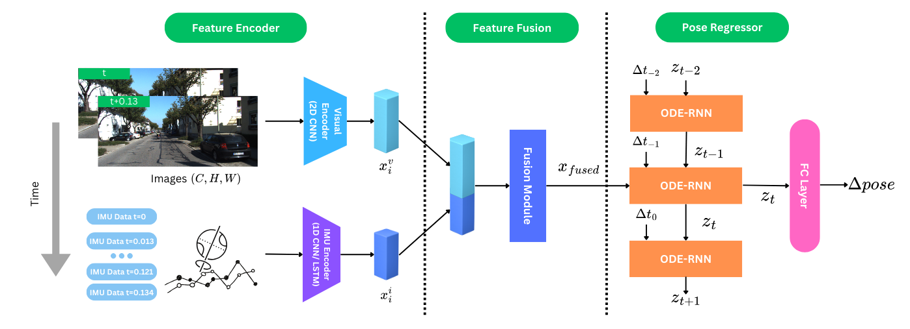
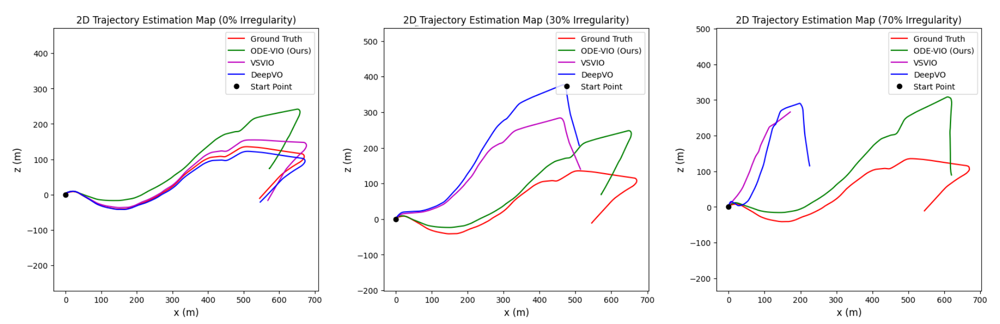

# Deep Continuous VIO: Advancing End-to-End Visual-Inertial Odometry with Neural ODEs


This repository contains the official code for the implmentation of ODE-VIO, a visual-inertial odometry (VIO) algorithm using Neural ODEs. The Neural ODEs component learns to parameterise a continuoous function to the hidden state, so data that arrives at abritrary timestamps are handled naturally. This makes it more suitable for handling irregularly sampled data compared to traditional RNNs. We have shown that our model performs up to 40% better in relative translational error compared to existing models. 

The overall architecture of ODE-VIO is shown below. It is trained and tested on the KITTI odometry benchmark. 

 

Some of the code are referenced from the code from Yang et al. in their [open-source repository](https://github.com/mingyuyng/Visual-Selective-VIO/tree/main). These include the data preparation script, code for computing KITTI metrics, and skeleton of the model and training loop. 

## Repository Structure

```
ODE-VIO/
├── README.md
├── dataset/
│   ├── data_prep.sh/               # Dataset preparation script
│   └── imus/                       # IMU data
├── scripts/
│   ├── run_training.sh             # Script to run training
│   ├── run_testing.sh              # Script to run testing
│   ├── train_model.py              # Training entry point
│   ├── test_model.py               # Testing entry point
│   └── config.py                   # Default parameters in argparse
├── src/
│   └── utils/
│       ├── params.py               # Load parameters
│       ├── profiler.py             # Pytorch profiler code
│       └── utils.py                # Handling directories, logging, gpu
│   └── data/
│       ├── KITTI_dataset.py        # Dataset preprocessing and loading
│       ├── KITTI_eval.py           # Dataset loading for testing 
│       ├── transforms.py           # Data transformations 
│       └── utils.py                # Metrics calculation, linear algebra
│   └── models/
│       ├── DeepVIO.py              # Entry point of model forward pass
│       ├── Encoder.py              # Image and inertial encoders
│       ├── FusionModule.py         # Fusion module to combine visual and inertial features
│       ├── PoseODERNN.py           # ODE-RNN pose regressor (ODE-VIO)
│       ├── PoseCDE.py              # Neural CDE pose regressor
│       └── ODEFunc.py              # ODE and CDE function
└── requirements.txt
```

## Preprequisites

Python 3.10 is used for training. The models are trained and tested on NVIDIA RTX3090 with cuda 12.4. 

The other prerequisite libraries can be downloaded through running the commands below.

```bash
python3 -m venv venv
source venv/bin/activate
pip3 install -r requirements.txt
```

## Dataset Preparation

To prepare the dataset, we can run the script `dataset/data_prep.sh`. It downloads all the necessary seqeunces for training and testing. Specifically, image seqeunce 00 to seqeunce 10 are downloaded as they contain ground truth data. IMU data is provided in the `dataset` directory. 


```bash
bash dataset/data_prep.sh
```

## Loading Pretrained Models

Pretrained Flownet and ODE-VIO are provided in a [google drive link](https://drive.google.com/drive/folders/1XGc1tCsitoZjuzjjWoqU3q3KRTLK7Do9?usp=sharing). Download both files and store them in a directory created with the following commands. 

```bash
mkdir pretrained_models
```

When using the pretrained models, remember to specify the pretrained path as a parameter in the python command in `run_training.sh`

Note that in the google drive, `ode-vio-v1` is the one evaluated for the report. `ode-vio-v2` is a fine-tuned version and will be continuously updated as we discover a better set of hyperparameters.

## Training the Model

Running the model is simple. Firstly, make sure you review the parameters specified in `scripts/config.py`. It shows the parameters that you can change, including the locations of pretrained models, learning rate, batch size, etc. Then, change the parameters to your configuration in the train_model.py.

In our setup, wandb is used for visualisation of the runs. It is highly recommended that you setup a [wandb account](https://wandb.ai/). If wandb is should not be used, simply remove the parameter from the run configuration.

The command to start the training is the following:
```bash
bash scripts/train_model.py
```

## Testing the Model

Make sure you change the path parameters for the pretrained model before testing.
After changing the parameters in `scripts/test_model.py`, testing the model is simplly running the following command:

```bash
bash scripts/test_model.py
```

The following plot shows comparison against various state-of-the-art methods under irregular sampling condition

 


